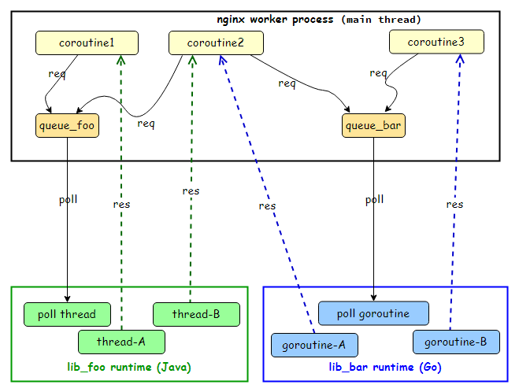

# lua-resty-ffi

lua-resty-ffi provides an efficient and generic API to do hybrid programming in openresty with mainstream languages (Go, Python, Java, Rust, etc.).

**Features:**
* simple but extensible interface, supports any C ABI compliant language
* once and for all, no need to write C/Lua codes to do coupling anymore
* high performance, faster than unix domain socket way
* loader library for python/java
* any serialization message format you like

## Quickstart

Take golang as example:

```bash
# in one terminal
# compile and install openresty with lua-resty-ffi
./build.sh

cd examples/go

# install golang if not yet
wget https://go.dev/dl/go1.19.3.linux-amd64.tar.gz
rm -rf /usr/local/go && tar -C /usr/local -xzf go1.19.3.linux-amd64.tar.gz
export PATH=$PATH:/usr/local/go/bin

# compile example libraries
make

# run nginx
make run

# in another terminal
curl http://localhost:20000/echo
ok
```

Please check directory of each programming language for detail.

## Background

In openresty land, when you turn to implement some logic, especially to couple with third-party popular frameworks, it's likely to suck in awkward: make bricks without straw.

1. C is a low-level language, no unified and rich libraries and ecosystem, and most modern frameworks do not support C, instead, they like Java, Python, Go. C is suitable for fundamental software.

2. Lua is an embedded and minimal programming language, which means all powers come from the host. In openresty, it means all functionalities come from lua-nginx-modules. Like C, or even worse, you have to reinvent the wheels via cosocket to do modern networking stuff. A lot of lua-resty-* were born, but they are almost semi-finished compared to native lib in other languages. For example, lua-resty-kafka doesn't support consumer groups, lua-resty-postgres doesn't support notify and prepared statements, etc. Moreover, most of those authors of lua-resty-* stop development at some stage because the lua community is so small and less attractive.

**Why not WASM?**

WASM has below shortages, which make it not suitable for openresty:

* no coroutine, which means you need to execute the logic from start to end and block the nginx worker process with arbitrary time
* castrated language support, e.g.
  * Go: You have to use tinygo instead, not the batteries-included official golang.
  * Rust: You have to use specialized crates to do jobs, e.g. when you need async network programming,
[tokio](https://tokio.rs/) is unavailable, instead, you have to use WASI based crates, e.g. [`wasmedge_wasi_socket`](https://wasmedge.org/book/en/write_wasm/rust/networking-nonblocking.html).
  * Python: You have to use implementations which support WASM, e.g. rustpython.
* complex development, due to sandbox original intention, you have to export a lot of API for callbacks from nginx

**So, may I extend the openresty with modern programming languages (Go, Python, Java, Rust, etc.)
and reuse their rich ecosystems directly? Yes, that's what lua-resty-ffi does.**

## Architecture



## Concepts

### Library

In Go and Rust, it means the compiled library, e.g. `libffi_go_etcd.so`.

In Python3, it means the loader library `libffi_python3.so` with native python3 modules.

In Java, it means the loader library `libffi_java.so` with native Java classes/jar.

### Library configuration

Configuration of the library, e.g. etcd endpoints, kafka endpoints, etc.

The format could be any serialization format, e.g. json, yaml, as long as it matches the runtime 

### Runtime

The combination of library and configuration would init a new runtime,
which represents some threads or goroutines to do jobs.

You could use the same library with different configurations, which is very common,
especially for Java and Python.

### Request-Response Model

Coupling between nginx worker process and the runtime is based on message exchanges, which contains two directions:

1. **Request**

* the lua coroutine creates a task
* associate the task with request message, which is C `malloc()` char array. Note that
this char array would be freed by lua-resty-ffi, and the runtime just uses it.
* put the task into the thread-safe queue of the runtime and yield
* the runtime polls this queue

Why not call API provided by other languages?
* In Go, due to GMP model, it may block the nginx worker process
* It increases the burden for other languages to provide such API

2. **Response**

The runtime injects the response (also C `malloc()` char array)
into the `ngx_thread_pool_done` queue directly and notify the nginx epoll loop via eventfd,
the nginx would resumes the lua coroutine then. Note that the response would be
freed by lua-resty-ffi, so no need to care about it in your runtime.

## Lua API

### `local runtime = ngx.load_ffi(lib, cfg, opts)`

Load and return the runtime

* `lib`
shared library name. It could be absolute file path or name only,
or even short name (e.g. for `libdemo.so`, the short name is `demo`).
When the `lib` is in name, it's searched according to `LD_LIBRARY_PATH` environment variable.

* `cfg` configuration, it could be string or nil.

* `opts` options table.

```lua
{
    -- the maximum queue size for pending requests to the runtime.
    -- it determines the throughput of requests, if the queue is full,
    -- all following requests would fail.
    max_queue = 65536,

    -- denotes whether the symbols loaded from library
    -- would be exported in global namespace, which is only necessary for python3.
    is_global = false,

    -- by default, all libraries handles would be cached by lua-resty-ffi
    -- because currently, only python and rust could be hot-reload,
    -- and java must not be `dlclose()`
    -- unpin is used to enable hot-reload
    -- note that it's different from the unload/reload of runtime,
    -- which is application-specific behavior, but library unload/reload is
    -- done by the linker via dlopen()/dlclose().
    unpin = false,
}
```

This API is idempotent. The loaded runtime is cached in internal table, where
the table key is `lib .. '&' .. cfg`.

This function calls the `libffi_init()` of the library per key.

It means the same library with different configuration would init a different new runtime,
which is especially useful for python3 and Java.

Example:

```lua
local opts = {is_global = true}
local demo = ngx.load_ffi("libffi_python3.so",
    [[ffi.kafka,init,{"servers":"localhost:9092", "topic":"foobar", "group_id": "foobar"}]], opts)
```

### `local ok, res_or_rc, err = runtime:call(req)`

Send a request to the rutnime and returns the response.

* `req` the request string, could be in any serialization format, e.g. json, protobuf, as long as it matches the runtime implementation.

* `ok` return status, true or false.

* `res_or_rc` response string, could be in any serialization format, e.g. json, protobuf, as long as it matches the runtime implementation. When the runtime returns non-zero `rc`, `ok` is false, the `res_or_rc` is the returned value by the runtime.

* `err` the error string, it may exist only if `ok` is false. It may be nil if the runtime does not return error.

This method is nonblocking, which means the coroutine would yield waiting for the response and resume with the return values.

Note that the method name `call` could be any name you like, it would be generated automatically by the `__index` meta function, and only used to denote the request semantics。

Example:

```lua
local ok, res
ok, res = demo:produce([[{"type":"produce", "msg":"hello"}]])
assert(ok)
ok, res = demo:produce([[{"type":"produce", "msg":"world"}]])
assert(ok)
ngx.sleep(2)
ok, res = demo:consume([[{"type":"consume"}]])
assert(ok)
ngx.say(res)
```

### `local ok, res = runtime:__unload()`

Unload the runtime, after that, no request could be sent to this runtime anymore.
The runtime would receive a NULL task, and it must terminate everything including the threads.
Note that it's an asynchronous processing, and the NULL task is appended to the queue, so
all pending normal tasks would be handled first.

## API provided by runtime

### `int libffi_init(char* cfg, void *tq);`

This API is provided by the library to initiate its logic and start the poll thread/goroutine.

`cfg` is null-terminated C string, it would get freed by lua-resty-ffi
after `libffi_init()` returns, which may be `NULL`.

`tq` is the task queue pointer, used by below APIs.

Example:

```go
//export libffi_init
func libffi_init(cfg *C.char, tq unsafe.Pointer) C.int {
    data := C.GoString(cfg)
    ...
    go func() {
        for {
            task := C.ngx_http_lua_ffi_task_poll(tq)
            if task == nil {
                break
            }
            var rlen C.int
            r := C.ngx_http_lua_ffi_get_req(task, &rlen)
            res := C.malloc(C.ulong(rlen))
            C.memcpy(res, unsafe.Pointer(r), C.ulong(rlen))
            C.ngx_http_lua_ffi_respond(task, 0, (*C.char)(res), rlen)
        }
    }()
    return 0
}
```

## APIs used by runtime

### `void* ngx_http_lua_ffi_task_poll(void *tq);`

Poll the task from the task queue assigned to the runtime.

When it returns `NULL`, it denotes the runtime was unloaded, the runtime must clean up
everything and do not access the task queue anymore (because the task queue was deallocated)!

### `char* ngx_http_lua_ffi_get_req(void *tsk, int *len);`

Extract the request from the task. Note that the request could be NULL, so the runtime must not use this API
in this case.

### `void ngx_http_lua_ffi_respond(void *tsk, int rc, char* rsp, int rsp_len);`

Response the task.

All above APIs are thread-safe. So you could use them in anywhere in your thread/goroutine of your runtime.

* `rc` return status, `0` means successful, other values means failure.
* `rsp` response char array, may be NULL if the runtime does not need to response something.
* `rsp_len` the length of response, may be `0` if the `rsp` is NULL or `\0' terminated C string.

If `rc` is non-zero, then the runtime may also set `rsp` and `rsp_len` if it need to return error data.

## How to set `LD_LIBRARY_PATH`?

Dynamic linker will ignore some environment variables, e.g. `LD_LIBRARY_PATH`, when run with setuid.
That is, when you use [`user user [group];`](http://nginx.org/en/docs/ngx_core_module.html#user) in `nginx.conf`,
`dlopen()` used by luajit `ffi.load()` would not use `LD_LIBRARY_PATH` as library search paths.

The workaround is to set `LD_LIBRARY_PATH` globally.

For example, set `LD_LIBRARY_PATH` for java:

```bash
cat > /etc/ld.so.conf.d/ffi.conf <<EOF
/usr/lib/jvm/java-11-openjdk-amd64/lib
/usr/lib/jvm/java-11-openjdk-amd64/lib/server
/opt/lua-resty-ffi/examples/java
EOF

# update ld.so.cache
ldconfig
```
