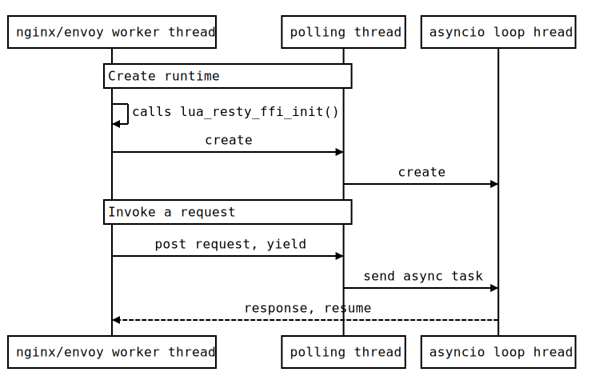

# lua-resty-ffi

lua-resty-ffi provides an efficient and generic API to do hybrid programming in openresty with mainstream languages
([Go](examples/go), [Python](examples/python), [Java](examples/java), [Rust](examples/rust), [Node.js](examples/nodejs), etc.).

**Now it supports [Envoy](https://www.envoyproxy.io/docs/envoy/latest/configuration/http/http_filters/lua_filter)!**

**That means all lua-resty-ffi based libraries (e.g. [lua-resty-ffi-grpc](https://github.com/kingluo/lua-resty-ffi-grpc)) can run on both Nginx and Envoy seamlessly without code changes.**

**Features:**
* nonblocking, in coroutine way
* simple but extensible interface, supports any C ABI compliant language
* once and for all, no need to write C/Lua codes to do coupling anymore
* high performance, [faster](benchmark.md) than unix domain socket way
* generic loader library for python/java/nodejs
* any serialization message format you like

**TODO:**
* [x] envoy porting
* [ ] batch polling
* [ ] use spinlock
* [ ] python: support running venv package based on sub-interpreter
* [ ] logging to nginx error.log (aware of file rotation), e.g. python [WatchedFileHandler](https://stackoverflow.com/questions/9106795/python-logging-and-rotating-files)
* [ ] shared_dict API

**Sub-Projects:**
* Go
  * [lua-resty-ffi-etcd](https://github.com/kingluo/lua-resty-ffi-etcd)
  * [lua-resty-ffi-kafka](https://github.com/kingluo/lua-resty-ffi-kafka)
  * [lua-resty-ffi-req](https://github.com/kingluo/lua-resty-ffi-req) HTTP 1/2/3 client
* Python
  * [lua-resty-ffi-ldap](https://github.com/kingluo/lua-resty-ffi-ldap) ldap client, supports all SASL auth methods
  * [lua-resty-ffi-graphql-resolver](https://github.com/kingluo/lua-resty-ffi-graphql-resolver) embed graphql server into nginx
  * [lua-resty-ffi-soap](https://github.com/kingluo/lua-resty-ffi-soap) The openresty SOAP to REST library based on zeep.
* Rust
  * [lua-resty-ffi-grpc](https://github.com/kingluo/lua-resty-ffi-grpc) grpc client based on tonic

## Architecture




Useful blog post:

[Implement Grpc Client in Rust for Openresty](http://luajit.io/post/implement-grpc-client-in-rust-for-openresty/) ([Chinese version](https://zhuanlan.zhihu.com/p/586934870))

## Quickstart

### Install lua-resty-ffi via luarocks

* specify your openresty source path in variable `$OR_SRC`
* ensure openresty source are already configured and built according to your product release

```bash
luarocks config variables.OR_SRC /tmp/tmp.Z2UhJbO1Si/openresty-1.21.4.1
luarocks install lua-resty-ffi
```

### Demo

Take golang as an example:

```bash
cd examples/go

# install golang if not yet, see https://go.dev/doc/install
# compile example libraries
make

# run nginx
make run

# in another terminal
curl http://localhost:20000/echo
ok
```

### envoy

Blog:

http://luajit.io/posts/make-lua-resty-ffi-run-on-envoy/

http://luajit.io/posts/envoy-async-http-filter-lua-resty-ffi-vs-golang/

Repo:

https://github.com/kingluo/envoy/tree/lua-resty-ffi

```bash
# compile envoy
cd /opt
git clone https://github.com/kingluo/envoy
cd envoy
git checkout origin/lua-resty-ffi

./ci/run_envoy_docker.sh './ci/do_ci.sh bazel.dev'

ln -f /tmp/envoy-docker-build/envoy/source/exe/envoy/envoy /usr/local/bin/envoy

# run demo
cd /opt/envoy/examples/lua
PYTHONPATH=/opt/lua-resty-ffi/examples/python/ \
LD_LIBRARY_PATH=/opt/lua-resty-ffi/examples/python \
LUA_PATH='/opt/lua-resty-ffi/?.lua;;' \
envoy -c envoy.yaml --concurrency 1

curl -v localhost:8000/httpbin/get
```

**envoy.yaml snippet:**

```yaml
  http_filters:
  - name: lua_filter_with_custom_name_0
    typed_config:
      "@type": type.googleapis.com/envoy.extensions.filters.http.lua.v3.Lua
      default_source_code:
        inline_string: |
          function envoy_on_request(request_handle)
            require("resty_ffi")
            local demo = ngx.load_ffi("ffi_go_echo")
            local ok, res = demo:foobar("foobar", request_handle)
            assert(ok)
            assert(res == "foobar")
            local demo = ngx.load_ffi("resty_ffi_python", "ffi.echo?,init", {is_global = true})
            local ok, res = demo:echo("hello", request_handle)
            assert(ok)
            assert(res == "hello")
          end
```

## Background

In openresty land, when you turn to implement some logic, especially to couple with third-party popular frameworks, it's likely to suck in awkward: make bricks without straw.

1. C is a low-level language, with no unified and rich libraries and ecosystems, and most modern frameworks do not support C, instead, they like Java, Python, Go. C is suitable for fundamental software.

2. Lua is an embedded and minimal programming language, which means all powers come from the host. In openresty, it means all functionalities come from lua-nginx-modules. Like C, or even worse, you have to reinvent the wheels via cosocket to do modern networking stuff. A lot of `lua-resty-*` was born, but they are almost semi-finished compared to native lib in other languages. For example, `lua-resty-kafka` doesn't support consumer groups, `lua-resty-postgres` doesn't support notify and prepared statements, etc. Moreover, most of those authors of `lua-resty-*` stop development at some stage because the lua community is so small and less attractive.

**Why not WASM?**

WASM has below shortages, which make it not suitable for openresty:

* no coroutine, which means you need to execute the logic from start to end and block the nginx worker process with arbitrary time
* castrated language support, e.g.
  * Go: You have to use tinygo instead, not the batteries-included official golang.
  * Rust: You have to use specialized crates to do jobs, e.g. when you need async network programming,
[tokio](https://tokio.rs/) is unavailable, instead, you have to use WASI-based crates, e.g. [`wasmedge_wasi_socket`](https://wasmedge.org/book/en/write_wasm/rust/networking-nonblocking.html).
  * Python: You have to use implementations that support WASM, e.g. rustpython.
* complex development, due to sandbox original intention, you have to export a lot of API from nginx

**So, may I extend the openresty with modern programming languages (Go, Python, Java, Rust, etc.)
and reuse their rich ecosystems directly? Yes, that's what lua-resty-ffi does.**

## Concepts

### Library

In Go and Rust, it means the compiled library, e.g. `libffi_go_etcd.so`.

In Python3, it means the loader library `libffi_python3.so` with native python3 modules.

In Java, it means the loader library `libffi_java.so` with native Java classes/jar.

In Node.js, it means the loader library `libffi_nodejs.so` with native nodejs modules.

### Library configuration

Configuration of the library, e.g. etcd endpoints, kafka endpoints, etc.

The format could be any serialization format, e.g. json, yaml, as long as it matches the runtime 

### Runtime

The combination of library and configuration would init a new runtime,
which represents some threads or goroutines to do jobs.

You could use the same library with different configurations, which is very common,
especially for Java, Python and Node.js.

### Request-Response Model

Coupling between nginx worker process and the runtime is based on message exchanges, which contain two directions:

1. **Request**

* the lua coroutine creates a task
* associates the task with the request message, which is C `malloc()` char array. Note that
this char array would be freed by lua-resty-ffi, and the runtime just uses it.
* put the task into the thread-safe queue of the runtime and yield
* the runtime polls this queue

Why not call API provided by other languages?
* In Go, due to GMP model, it may block the nginx worker process
* It increases the burden for other languages to provide such API

2. **Response**

The runtime injects the response (also C `malloc()` char array)
into the `ngx_thread_pool_done` queue [**directly**](https://github.com/kingluo/lua-resty-ffi/blob/main/patches/ngx_thread_pool.c.patch) and notify the nginx epoll loop via eventfd,
the nginx would resume the lua coroutine then. Note that the response would be
freed by lua-resty-ffi, so no need to care about it in your runtime.

## IPC design and Benchmark

[Benchmark compared to unix domain socket.](benchmark.md)

## Lua API

### `local runtime = ngx.load_ffi(lib, cfg, opts)`

Load and return the runtime

* `lib`
shared library name. It could be an absolute file path or name only,
or even a short name (e.g. for `libdemo.so`, the short name is `demo`).
When the `lib` is name only or short name, it's searched according to `LD_LIBRARY_PATH` environment variable.

* `cfg` configuration, it could be string or nil.

* `opts` options table.

```lua
{
    -- the maximum queue size for pending requests to the runtime.
    -- it determines the throughput of requests if the queue is full,
    -- all following requests would fail.
    max_queue = 65536,

    -- denotes whether the symbols loaded from the library
    -- would be exported in the global namespace, which is only necessary for python3 and nodejs.
    is_global = false,

    -- by default, all libraries handles would be cached by lua-resty-ffi
    -- because currently, only python and rust could be hot-reload,
    -- and java must not be `dlclose()`
    -- unpin is used to enable hot-reload
    -- note that it's different from the unload/reload of runtime,
    -- which is application-specific behavior, but library unload/reload is
    -- done by the linker via dlopen()/dlclose().
    unpin = false,
}
```

This API is idempotent. The loaded runtime is cached in an internal table, where
the table key is `lib .. '&' .. cfg`.

This function calls the `libffi_init()` of the library per key.

It means the same library with a different configuration would initiate a different new runtime,
which is especially useful for python3, Java and Node.js.

Example:

```lua
local opts = {is_global = true}
local demo = ngx.load_ffi("ffi_python3",
    [[ffi.kafka,init,{"servers":"localhost:9092", "topic":"foobar", "group_id": "foobar"}]], opts)

local demo = ngx.load_ffi("ffi_go_etcd", "[\"localhost:2379\"]")
```

### `local ok, res_or_rc, err = runtime:call(req)`

Send a request to the runtime and returns the response.

* `req` the request string, could be in any serialization format, e.g. json, protobuf, as long as it matches the runtime implementation.

* `ok` return status, true or false.

* `res_or_rc` response string, could be in any serialization format, e.g. json, protobuf, as long as it matches the runtime implementation. When the runtime returns non-zero `rc`, `ok` is false, and the `res_or_rc` is the returned value by the runtime.

* `err` the error string, it may exist only if `ok` is false. It may be nil if the runtime does not return an error.

This method is nonblocking, which means the coroutine would yield waiting for the response and resume with the return values.

Note that the method name `call` could be any name you like, it would be generated automatically by the `__index` meta function, and only used to denote the request semantics。

Example:

```lua
local ok, res
ok, res = demo:produce([[{"type":"produce", "msg":"hello"}]])
assert(ok)
ok, res = demo:produce([[{"type":"produce", "msg":"world"}]])
assert(ok)
ngx.sleep(2)
ok, res = demo:consume([[{"type":"consume"}]])
assert(ok)
ngx.say(res)
```

### `local ok, res = runtime:__unload()`

Unload the runtime, after that, no request could be sent to this runtime anymore.
The runtime would receive a NULL task, and it must terminate everything including the threads.
Note that it's asynchronous processing, and the NULL task is appended to the queue, so
all pending normal tasks would be handled first.

## API provided by the runtime

### `int libffi_init(char* cfg, void *tq);`

This API is provided by the library to initiate its logic and start the poll thread/goroutine.

`cfg` is a null-terminated C string, it would get freed by lua-resty-ffi
after `libffi_init()` returns, which may be `NULL`.

`tq` is the task queue pointer, used by the below APIs.

Example:

```go
//export libffi_init
func libffi_init(cfg *C.char, tq unsafe.Pointer) C.int {
    data := C.GoString(cfg)
    ...
    go func() {
        for {
            task := C.ngx_http_lua_ffi_task_poll(tq)
            if task == nil {
                break
            }
            var rlen C.int
            r := C.ngx_http_lua_ffi_get_req(task, &rlen)
            res := C.malloc(C.ulong(rlen))
            C.memcpy(res, unsafe.Pointer(r), C.ulong(rlen))
            C.ngx_http_lua_ffi_respond(task, 0, (*C.char)(res), rlen)
        }
    }()
    return 0
}
```

## APIs used by the runtime

### `void* ngx_http_lua_ffi_task_poll(void *tq);`

Poll the task from the task queue assigned to the runtime.

When it returns `NULL`, it denotes the runtime was unloaded, the runtime must clean up
everything and not access the task queue anymore (because the task queue was deallocated)!

### `char* ngx_http_lua_ffi_get_req(void *tsk, int *len);`

Extract the request from the task. Note that the request could be NULL, so the runtime must not use this API
in this case.

### `void ngx_http_lua_ffi_respond(void *tsk, int rc, char* rsp, int rsp_len);`

Response to the task.

All the above APIs are thread-safe. So you could use them anywhere in the thread/goroutine of your runtime.

* `rc` return status, `0` means successful, and other values mean failure.
* `rsp` response char array, may be NULL if the runtime does not need to respond to something.
* `rsp_len` the length of response, maybe `0` if the `rsp` is NULL or `\0' terminated C string.

If `rc` is non-zero, then the runtime may also set `rsp` and `rsp_len` if it needs to return error data.

## Code hot-reload

[How to do code hot-reload in lua-resty-ffi?](https://github.com/kingluo/lua-resty-ffi/blob/main/hot-reload.md)
