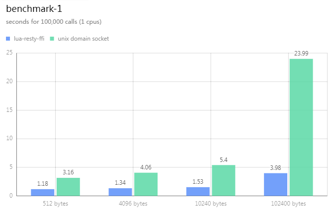
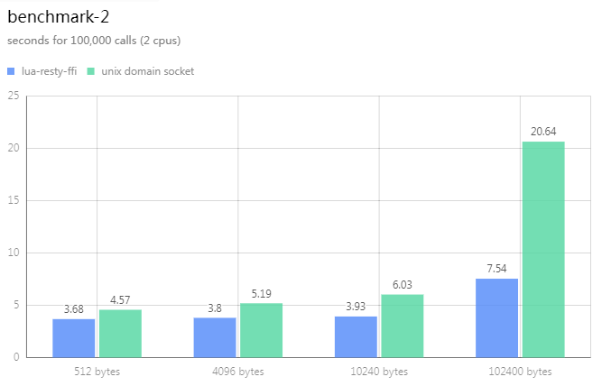

lua-resty-ffi has a high performance IPC mechanism, based on request-response model.

Let's check what happens in two directions of such IPC.

## request

The request from lua is appended to a queue. This queue is protected by pthread mutex.
The language runtime polls this queue, if it's empty, then wait on the queue via `pthread_cond_wait()`.
In busy scenario, almost all enqueue/dequeue happens in userspace, without `futex` system calls.

## response

lua-resty-ffi makes full use of nginx nonblocking event loop to dispatch the response from the language runtime.
The response would be injected into the global done queue of nginx, and notify the nginx main thread via eventfd
to handle it. In main thread, the response handler would setup the return value and resume the coroutine
waiting on the response.

Note that not like [`ngx.run_worker_thread()`](https://github.com/openresty/lua-nginx-module#ngxrun_worker_thread)
(which is also my work contributed to openresty), I do not use nginx thread pool to wait for the response from language runtime.
Instead, we inject it into the global queue of the main thread, which is really a shortcut to boost the performance!

As known, linux eventfd is high performance. It's just an accumulated counter, so multiple responses
would be folded into one event.

Both request and response data are exchanged in userspace.

## unix domain socket

In legacy way, we would establish a dedicated process to handle requests from nginx. That's known as proxy model.

However, unix domain socket is low efficient than mutex/eventfd way, becuase all data are exchanged in kernel space,
involving many system calls and context switches, and moreover, the user program need to prefix the data with length,
because every packet is streaming in the socket.

## benchmark

Let's verify it via the echo example.

[benchmark.lua](examples/go/benchmark.lua)

* echo in lua-resty-ffi way:

```lua
local demo = ngx.load_ffi("ffi_go_echo")
ngx.update_time()
local t1 = ngx.now()
for _ = 1,n do
    -- the echo call is very simple, just send and handle the return value
    -- no need to prefix the data with length indicator.
    -- both request and response are string, with any format you prefer to use.
    -- in this example, they are plain C string.
    local ok, res = demo:echo(buf)
    assert(ok)
    assert(res==buf)
end
ngx.update_time()
local t2 = ngx.now()
ngx.say("ffi: ", t2-t1)
ngx.flush(true)
```

* echo in unix domain socket way:

```lua
-- we use cosocket to access unix socket server
local sock = ngx.socket.tcp()
local ok, err = sock:connect("unix:/tmp/echo.sock")
assert(ok)

local tbuf = {}
local hdr_buf = ffi.new("unsigned char[4]")

ngx.update_time()
local t1 = ngx.now()
for _ = 1,n do
    -- see, we need to encode the request length
    local len = buflen
    for i = 3, 0, -1 do
        hdr_buf[i] = band(len, 255)
        len = rshift(len, 8)
    end

    tbuf[1] = ffi_str(hdr_buf, 4)
    tbuf[2] = buf
    local sent = sock:send(tbuf)
    assert(sent==buflen+4)

    -- and, we need to receive the response in two parts:
    -- first, we need to read the length and decode it,
    -- second, we turn to receive the real response data.
    -- In openresty, cosocket doesn't have read-any-avaliable
    -- semantic, so we have to use two steps here.
    local hdr = sock:receive(4)
    local hi, mi, li, lli = str_byte(hdr, 1, 4)
    local len = 256 * (256 * (256 * hi + mi) + li) + lli
    assert(len==buflen)
    local data = sock:receive(len)
    assert(data==buf)
end
ngx.update_time()
local t2 = ngx.now()
ngx.say("uds: ", t2-t1)
sock:close()
ngx.flush(true)
```

### benchmark result

I use AWS EC2 t2.medium (Ubuntu 22.04) to do the benchmark.

```bash
# in terminal-1
cd examples/go
make run

# in terminal-2
cd examples/go
go run unix_socket_server.go

# in terminal-3
curl 'localhost:20000/benchmark?times=100000&arr=512,4096,10240,102400'
```





Here I use `taskset` to simulate one CPU scenario.
Send 100,000 requests, in lenght of 512B, 4096B, 10KB, 100KB perspectively.
The result is in seconds, lower is better.

You could see that lua-resty-ffi is faster than unix domain socket, and the difference
is proportional to the length.
